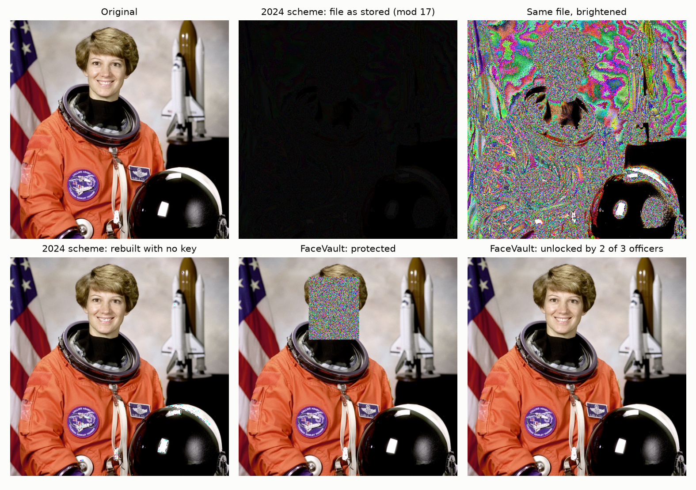
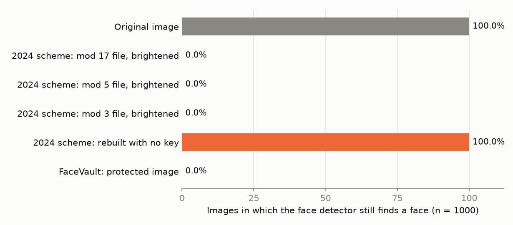
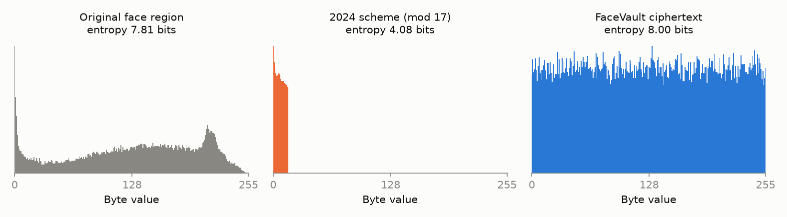
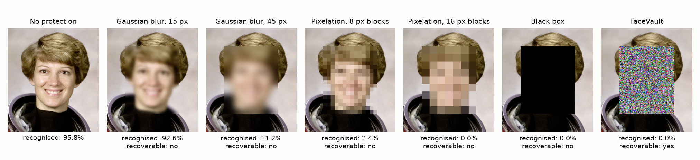
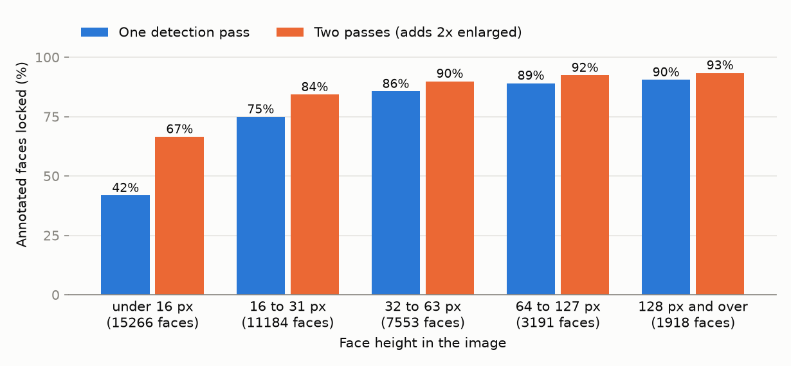

# FaceVault

Surveillance that keeps faces locked until authorised people unlock them.

A camera image goes in. Every face in it is encrypted in place, so the stored
image shows the scene with noise where the faces were. Unlocking needs key
shares from several officers (two of three by default), every unlock is
logged, and a watch-list match sends an encrypted, signed alert.



*Sample image: NASA portrait of Eileen Collins, public domain.*

## Two projects in this repository

| | Folder | What it is |
|---|---|---|
| **2024 original** | [original-2024/](original-2024/) | *Advanced Surveillance System with Encrypted Alerts and Privacy Enhancement*, a final-year team project, with its [published paper](https://doi.org/10.55041/IJSREM29001) |
| **2026 rebuild** | everything else | FaceVault, which keeps the goal and replaces the method |

## Where this came from

FaceVault is a rebuild of a 2024 final-year team project, *Advanced
Surveillance System with Encrypted Alerts and Privacy Enhancement*. That
version "encrypted" images by storing each pixel's remainders modulo 3, 5 and
17. Reviewing it showed that this is not encryption: there is no key, so the
stored files give the image back to anyone, and pixel value 255 is destroyed
on the way. The full review is in
[docs/review-of-2024-report.md](docs/review-of-2024-report.md).

The original 2024 code is kept unchanged in [original-2024/](original-2024/).
Its scheme is also available as a baseline inside FaceVault
(`facevault/legacy_rns.py`), which the tests show gives byte-identical output
to the original, together with the attacks on it (`facevault/attacks.py`), so
the comparison can be reproduced.

## How it works

| Part | What it does | Built with |
|---|---|---|
| Face detection | Finds faces on the CPU | OpenCV YuNet |
| Locking | Encrypts each face rectangle and writes the ciphertext into the same pixels | AES-256-GCM |
| Public-key camera | The camera derives each image's key from the vault's public key, so it cannot unlock what it locked | X25519, HKDF-SHA256 |
| Shared custody | The vault's private key is split so any *k* of *n* officers can rebuild it and fewer cannot | Asmuth-Bloom sharing (Chinese Remainder Theorem) |
| Alerts | A watch-list match is sent encrypted to the recipient and signed by the camera | SFace, X25519, ChaCha20-Poly1305, Ed25519 |
| Audit log | Every unlock and every refused attempt is recorded in a hash-chained file | SHA-256 |

The protected image is one PNG file. It carries everything needed to unlock it
except the private key. Changing a single bit of a face region, of the header,
or of the camera/time context makes unlocking fail; editing the rest of the
picture is reported.

No new cipher is invented here. The Chinese Remainder Theorem, which the 2024
project used on pixels, is used for the job it suits: sharing a key.

## Results

Measured on 1,000 randomly sampled images from the public LFW face dataset
and on the 3,226 images of the WIDER FACE validation set, on a laptop CPU. Every number comes from `python experiments/run_all.py`; the full
tables are in [results/tables.md](results/tables.md).

**The 2024 residue scheme**

| Measurement | Result |
|---|---|
| Images rebuilt from the stored files alone, with no key | 1,000 of 1,000 |
| Images damaged by the scheme's own decryption | 81.0% |
| Mean MSE after decryption (a cipher must give 0) | 244.37 |
| Stored size compared with the original PNG | 2.20x |
| Entropy of the stored files (ideal: 8 bits per byte) | 1.58, 2.30 and 4.02 bits |

**FaceVault**

| Measurement | Result |
|---|---|
| Unlocked image identical to the original, bit for bit | 1,000 of 1,000 |
| Pixels changed outside the face regions | 0 |
| Protected images in which a face detector still finds a face | 0 of 1,000 |
| Protected faces a face recogniser still matches to the original | 0 of 1,000 |
| Rejected: one bit flipped in a face region / changed context / wrong key | 100% / 100% / 100% |
| Entropy of the encrypted regions | 8.00000 bits per byte (pooled) |
| Correlation between neighbouring ciphertext pixels | 0.0001 (0.989 in the originals) |
| Time to lock / unlock a 250x250 image, after detection | 1.05 ms / 0.72 ms |
| Time to detect faces in a 1920x1080 frame | 97.7 ms |
| Watch-list matching, 500 people, one enrolled photo each | 96.4% of genuine pairs accepted; 0 of 500 impostor pairs accepted |
| Key sharing: every tested group of *k* officers rebuilt the key | 69 of 69 groups |
| Key sharing: *k* - 1 officers rebuilt the key | 0 of 600 trials |





**Against blur and pixelation**

Blurring or pixelating faces is what most systems do. The same face regions
were hidden by each method, and a face recogniser was then given a *different*
photo of the same person, as a watch-list would be (500 people).



| Method | Still recognised | Matched to a wrong person (chance) | Original recoverable |
|---|---|---|---|
| No protection | 95.8% | 0.0% | |
| Gaussian blur, 15 px | 92.6% | 0.2% | no |
| Gaussian blur, 45 px | 11.2% | 0.0% | no |
| Pixelation, 8 px blocks | 2.4% | 0.0% | no |
| Pixelation, 16 px blocks | 0.0% | 0.2% | no |
| Black box | 0.0% | 0.0% | no |
| FaceVault | 0.0% | 0.0% | yes, bit for bit |

Light blur hides almost nothing from a machine, and heavy blur still lets it
recognise one face in nine. The methods that do hide the face destroy it.
FaceVault is the only row that hides the face and can give it back. Its
protected faces are no more similar to the right person (mean similarity
0.027) than to a wrong one (0.026).

The recogniser here is an ordinary one that was never trained on blurred
faces, so these figures are a lower limit on what blur and pixelation leak.

**In crowded scenes: the limit**

Portraits are easy for a face detector. On the WIDER FACE validation set
(3,226 photos of real scenes, 39,112 hand-marked faces) the lock step misses
some faces, and a missed face is not locked. A face counts as locked when at
least 90% of its marked box is encrypted.



| Face height in the image | Faces | Locked, one detection pass | Locked, two passes |
|---|---|---|---|
| Under 16 px | 15,266 | 41.8% | 66.5% |
| 16 to 31 px | 11,184 | 74.9% | 84.2% |
| 32 to 63 px | 7,553 | 85.6% | 89.9% |
| 64 to 127 px | 3,191 | 89.1% | 92.4% |
| 128 px and over | 1,918 | 90.5% | 93.4% |

The second pass runs the detector again on the image enlarged 2x. It helps at
every size and costs time: 206 ms per image against 41 ms. For faces 32 px and
taller, 87.2% were locked with one pass and 91.0% with two, so in a crowd about
one face in eleven is still not fully locked. The cipher is sound; the face
detector is now the weak point, and a stronger detector is the next step.

Things the numbers also say, which matter as much as the good ones:

- **One residue file alone does not show a face.** A detector found no face in
  any single brightened file. The 2024 scheme fails because its files together
  need no key, not because each file is readable.
- **The detector, not the cipher, limits privacy.** With the lock step at the
  detector's usual confidence of 0.8, a face was still found in 9 of 1,000
  protected images. Every one of those detections lay outside the locked
  regions, on a face the lock step had scored just under its cut-off (in the
  cases inspected, a second person at the edge of the photo); none was a
  locked face. Locking at confidence 0.5
  brought this to 0 of 1,000 while locking 1.1 percentage points more of the
  image. The 0.5 setting was chosen on this same sample, so it needs checking
  on other data.
- **Locking only the faces is not faster than encrypting the whole frame.**
  At 1920x1080, FaceVault's lock step takes 13.6 ms against 6.9 ms for
  whole-frame AES-GCM; 11.1 ms of that is hashing the background for tamper
  detection. The reason to lock only faces is that the scene stays usable,
  not speed. Face detection (97.7 ms) dominates either way.
- **Protected files are larger.** Encrypted regions do not compress, so the
  protected PNG is 1.42x the original on these face-filling images.
- Counts involving the detector on protected images can move by a few images
  between runs, because the ciphertext noise is random.

## Run it

Needs Python 3.10 or newer. Tested on Windows 11 with Python 3.11.

```bash
python -m venv .venv
.venv\Scripts\activate
pip install -r requirements.txt
python scripts/fetch_models.py
```

On macOS or Linux the second line is `source .venv/bin/activate`.

Demo app:

```bash
streamlit run app.py
```

Command line:

```bash
python -m facevault setup --keys keys --threshold 2 --officers 3
python -m facevault protect photo.jpg -o protected.png --watchlist people/
python -m facevault reveal protected.png -o unlocked.png --share keys/shares/officer-1.json --share keys/shares/officer-3.json --reason "case 42"
python -m facevault read-alert outbox/<file>.alert.json
python -m facevault audit
python -m facevault legacy photo.jpg
```

Tests:

```bash
pytest
```

Reproduce the measurements (downloads LFW, about 230 MB, and the WIDER FACE
validation set, about 365 MB):

```bash
python -c "from sklearn.datasets import fetch_lfw_people; fetch_lfw_people(data_home='data', min_faces_per_person=100)"
python scripts/fetch_wider_face.py
python experiments/run_all.py
```

`python experiments/run_all.py --only crowd` reruns one step and keeps the
other saved results.

## Layout

```
facevault/
  vault.py        lock and unlock face regions; protected PNG format
  hybrid.py       public-key key agreement
  sharing.py      k-of-n key sharing
  alerts.py       encrypted, signed alerts
  audit.py        hash-chained unlock log
  detect.py       face detection and watch-list matching
  pipeline.py     the workflow that ties the parts together
  cli.py          command line
  legacy_rns.py   the 2024 scheme, kept as a baseline
  attacks.py      attacks on the 2024 scheme
  metrics.py      entropy, correlation, NPCR, UACI, MSE, PSNR
  obfuscate.py    blur, pixelation and black box, as baselines
app.py            Streamlit demo
experiments/      the script behind every number in this README
tests/            pytest suite
docs/             technical review of the 2024 report
original-2024/    the 2024 project as it was (original code and its README)
```

## Limits

- Still images only. Video would need the ciphertext to survive the video
  codec, which this design does not attempt.
- Protected images must be stored losslessly (PNG).
- A face the detector misses is not locked. Privacy is bounded by the
  detector, not by the cipher, which is why locking uses a low detection
  confidence (see Results).
- Hair, clothing and surroundings stay visible and can identify someone to a
  person who knows them.
- Asmuth-Bloom sharing hides the key statistically, not perfectly. Shamir's
  scheme is the usual production choice.
- The audit log detects edits. It cannot stop someone who can rewrite the whole
  file unless its latest hash is also kept somewhere else.
- The demo keeps every key on one machine. A real deployment puts the camera
  key, the alert recipient's key and each officer's share on separate devices.
- This is a student research project and has not had an independent security
  review.

## Responsible use

Face recognition in public places is restricted or banned in many
jurisdictions. Use this project only with images you have the right to
process: your own, consenting participants', or public research datasets.
The measurements here use LFW and WIDER FACE for aggregate statistics only;
no dataset image is included in this repository.

## Credits

- Original 2024 project: a five-student team (the author among them) at the
  Dept. of CSE (AI & ML), Vidyavardhaka College of Engineering, Mysuru. Its
  literature survey was published as Ranjan Kumar H S, Nisarga Nab,
  Paavani M R, Thashik R Paul, Varun S P and Dileep M, "Advanced Surveillance
  System with Encrypted Alerts and Privacy Enhancement", IJSREM, vol. 8,
  no. 3, March 2024, DOI [10.55041/IJSREM29001](https://doi.org/10.55041/IJSREM29001).
- This rebuild: Thashik R Paul, developed with AI assistance (Claude).
- Face models: [OpenCV Zoo](https://github.com/opencv/opencv_zoo) (YuNet, SFace).
- Datasets: Labeled Faces in the Wild, University of Massachusetts Amherst;
  WIDER FACE, The Chinese University of Hong Kong.

MIT licence. See [LICENSE](LICENSE).
